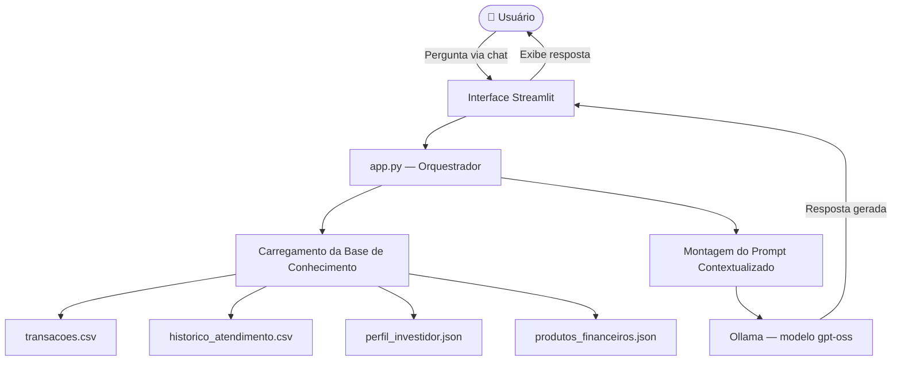

div align="center">

# ✨ AurumIA — Assistente Financeiro Inteligente

> Agente financeiro conversacional com IA Generativa, rodando 100% localmente com Ollama.  
> Desenvolvido como Projeto Final do Bootcamp **DIO + Bradesco 2026**.

---


</div>

---

## 📑 Índice

- [Sobre o Projeto](#-sobre-o-projeto)
- [Funcionalidades](#funcionalidades)
- [Tecnologias Utilizadas](#tecnologias-utilizadas)
- [Arquitetura do Agente](#arquitetura-do-agente)
- [Base de Conhecimento](#-base-de-conhecimento)
- [Como Executar](#-como-executar)
- [Estrutura do Repositório](#-estrutura-do-repositório)
- [Entregáveis do Desafio](#-entregáveis-do-desafio)
- [Autora](#autora)

---

## 💡 Sobre o Projeto

O **AurumIA** é um agente financeiro inteligente e proativo, desenvolvido com IA Generativa e executado localmente via **Ollama**. Ele vai além de um simples chatbot: analisa o perfil do cliente, interpreta seu histórico financeiro e oferece orientações personalizadas com foco em segurança e confiabilidade.

O projeto foi desenvolvido como entrega final do **Bootcamp DIO + Bradesco 2026**, com implementação funcional completa em Python e interface web interativa via Streamlit.

> **Por que "Aurum"?** Aurum é o nome latino do ouro — símbolo de valor, solidez e confiança. Exatamente o que se espera de um assistente financeiro.

---

## ⚙️ Funcionalidades

- 📊 **Análise de gastos recentes** com base no histórico de transações do cliente
- 🎯 **Acompanhamento de metas financeiras** (ex: reserva de emergência)
- 👤 **Interpretação do perfil do investidor** para respostas personalizadas
- 💼 **Sugestão de produtos financeiros** compatíveis com o perfil (sem recomendação direta)
- 📋 **Consulta ao histórico de atendimentos** anteriores
- ❓ **Responde dúvidas** sobre organização e planejamento financeiro
- 🛡️ **Segurança e transparência**: admite limitações quando não possui dados suficientes
- 🚫 **Foco no escopo**: recusa perguntas fora do domínio financeiro

---

## 🛠️ Tecnologias Utilizadas

| Tecnologia | Finalidade |
|---|---|
|  | Linguagem principal do projeto |
|  | Interface web interativa do chatbot |
|  | Leitura e análise dos arquivos CSV |
| **JSON** | Base de conhecimento estruturada |
| **Ollama** | Execução local do modelo de IA |
| **gpt-oss (via Ollama)** | Geração das respostas do agente |
| **Requests** | Comunicação entre Python e a API local do Ollama |
|  | Ambiente de desenvolvimento |
|  | Versionamento e entrega do projeto |

---

## 🏗️ Arquitetura do Agente



---

## 📂 Base de Conhecimento

O AurumIA utiliza dados mockados para simular um ambiente financeiro real:

| Arquivo | Formato | Descrição |
|---|---|---|
| `transacoes.csv` | CSV | Histórico de transações do cliente |
| `historico_atendimento.csv` | CSV | Atendimentos anteriores registrados |
| `perfil_investidor.json` | JSON | Perfil, objetivos e preferências do cliente |
| `produtos_financeiros.json` | JSON | Produtos e serviços financeiros disponíveis |

> Todos os dados são fictícios e foram utilizados exclusivamente para fins educacionais.

---

## 🚀 Como Executar

### Pré-requisitos

- [Python 3.11+](https://www.python.org/)
- [Ollama](https://ollama.ai/) instalado e rodando localmente
- Modelo `gpt-oss` disponível no Ollama

### Passo a passo

```bash
# 1. Clone o repositório
git clone https://github.com/fabianabellentani/dio-lab-bia-do-futuro.git
cd dio-lab-bia-do-futuro

# 2. Instale as dependências
pip install streamlit pandas requests

# 3. Certifique-se de que o Ollama está em execução
ollama run gpt-oss

# 4. Inicie a aplicação
streamlit run src/app.py
```

Acesse no navegador: `http://localhost:8501`

---

## 📁 Estrutura do Repositório

```
📁 dio-lab-bia-do-futuro/
│
├── 📄 README.md
│
├── 📁 data/                           # Base de conhecimento do agente
│   ├── historico_atendimento.csv      # Histórico de atendimentos (CSV)
│   ├── perfil_investidor.json         # Perfil do cliente (JSON)
│   ├── produtos_financeiros.json      # Produtos disponíveis (JSON)
│   └── transacoes.csv                 # Histórico de transações (CSV)
│
├── 📁 docs/                           # Documentação do projeto
│   ├── 01-documentacao-agente.md      # Caso de uso e arquitetura
│   ├── 02-base-conhecimento.md        # Estratégia de dados
│   ├── 03-prompts.md                  # Engenharia de prompts
│   └── 04-metricas.md                 # Avaliação e métricas
│
├── 📁 src/                            # Código da aplicação
│   └── app.py                         # Aplicação principal (Streamlit)
│
├── 📁 assets/                         # Imagens e diagramas
│
└── 📁 examples/                       # Referências e exemplos
    └── README.md
```

---

## ✅ Entregáveis do Desafio

| # | Entregável | Status |
|---|---|---|
| 1 | Documentação do Agente | ✅ Concluído |
| 2 | Base de Conhecimento | ✅ Concluído |
| 3 | Prompts do Agente | ✅ Concluído |
| 4 | Aplicação Funcional | ✅ Concluído |
| 5 | Avaliação e Métricas | ✅ Concluído |

---

## 👩‍💻 Autora

<div align="center">

**Fabiana Bellentani**

[](https://github.com/fabianabellentani)

*Projeto desenvolvido durante o Bootcamp DIO + Bradesco 2026*

</div>

---

<div align="center">

Feito com 💛 e muito ☕ por Fabiana Bellentani

</div>
