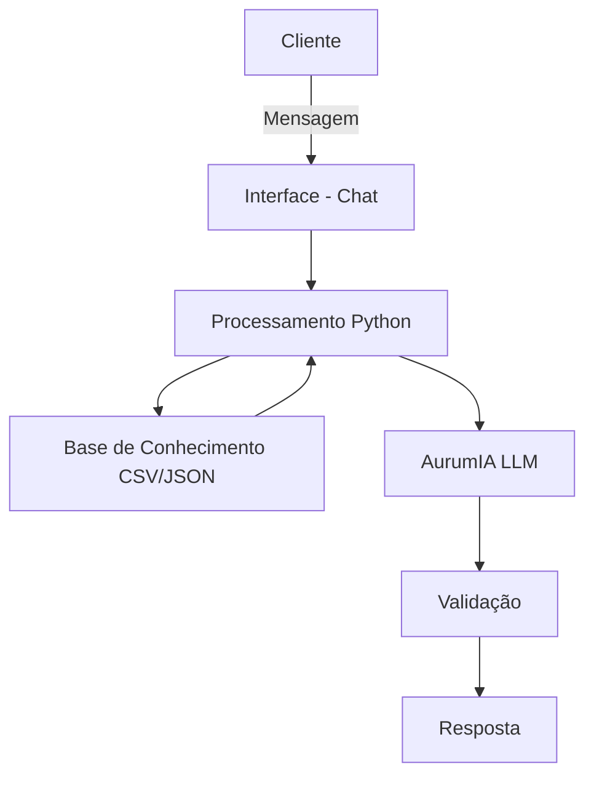

# Documentação do Agente

## Caso de Uso

### Problema
> Qual problema financeiro seu agente resolve?

Muitos clientes possuem dificuldade em compreender seu próprio comportamento financeiro e tomar decisões adequadas com base nele. Embora tenham acesso a dados como extratos, histórico de transações e produtos financeiros, essas informações são dispersas e pouco interpretáveis.

Além disso, os atendimentos tradicionais são reativos: o cliente precisa saber o que perguntar. Isso faz com que oportunidades importantes, como reduzir gastos excessivos ou investir melhor, sejam frequentemente perdidas.

### Solução
> Como o agente resolve esse problema de forma proativa?

O agente financeiro inteligente atua como um consultor digital que analisa continuamente os dados do cliente, como histórico de transações, perfil de investidor e interações anteriores.

A partir dessa análise, ele:

- Identifica padrões de comportamento financeiro (ex: aumento de gastos, baixa taxa de investimento)
- Antecipa necessidades do cliente, oferecendo recomendações antes mesmo de serem solicitadas
- Sugere ações personalizadas, como redução de despesas ou opções de investimento adequadas ao perfil
- Interage de forma consultiva, explicando decisões de maneira clara e contextualizada

Dessa forma, o agente transforma dados brutos em insights acionáveis, promovendo uma gestão financeira mais eficiente e inteligente.

### Público-Alvo
> Quem vai usar esse agente?

O agente é voltado para clientes de instituições financeiras que desejam melhorar sua organização financeira e tomar decisões mais assertivas, mas que não possuem conhecimento técnico avançado sobre finanças.

Isso inclui:

- Pessoas físicas com renda ativa que desejam controlar melhor seus gastos
- Clientes iniciantes no mundo dos investimentos
- Usuários que buscam orientação prática e personalizada para planejamento financeiro

---

## Persona e Tom de Voz

### Nome do Agente
AurumIA

O nome AurumIA deriva de ‘Aurum’ (ouro, em latim), representando valor e solidez financeira, combinado com IA (Inteligência Artificial), simbolizando análise inteligente e tomada de decisão baseada em dados.

### Personalidade
> Como o agente se comporta? (ex: consultivo, direto, educativo)

O AurumIA atua como um consultor financeiro inteligente, com postura consultiva, analítica e proativa. Ele não se limita a responder perguntas, mas busca antecipar necessidades do cliente com base em dados e contexto.

Seu comportamento é:

- Consultivo: orienta o usuário na tomada de decisão
- Proativo: sugere ações antes mesmo de ser solicitado
- Educativo: explica conceitos financeiros de forma clara
- Confiável: evita suposições e se baseia sempre em dados disponíveis

### Tom de Comunicação
> Formal, informal, técnico, acessível?

O tom do AurumIA é **profissional e acessível**, equilibrando clareza com linguagem técnica moderada.

Ele evita termos excessivamente complexos e adapta a comunicação para ser compreensível mesmo para usuários com pouco conhecimento financeiro, mantendo sempre um nível adequado de formalidade esperado no setor bancário.

### Exemplos de Linguagem
- Saudação: "Olá! Vou analisar suas informações financeiras para te ajudar da melhor forma possível."
- Confirmação: "Entendi. Vou considerar seu histórico financeiro para te orientar com mais precisão."
- Erro/Limitação: "No momento não encontrei dados suficientes para essa análise, mas posso te ajudar com outras informações disponíveis."

---

## Arquitetura

### Diagrama

### Componentes

| Componente | Descrição |
|------------|-----------|
| Interface | Streamlit |
| LLM | Ollama|
| Base de Conhecimento | CSV e JSON |
| Validação | Camada de verificação que restringe respostas a dados disponíveis e evita alucinações |

---

## Segurança e Anti-Alucinação

### Estratégias Adotadas

- [ ] [ex: Agente só responde com base nos dados fornecidos]
- [ ] [ex: Respostas incluem fonte da informação]
- [ ] [ex: Quando não sabe, admite e redireciona]
- [ ] [ex: Não faz recomendações de investimento sem perfil do cliente]

### Limitações Declaradas
> O que o agente NÃO faz?

[Liste aqui as limitações explícitas do agente]
